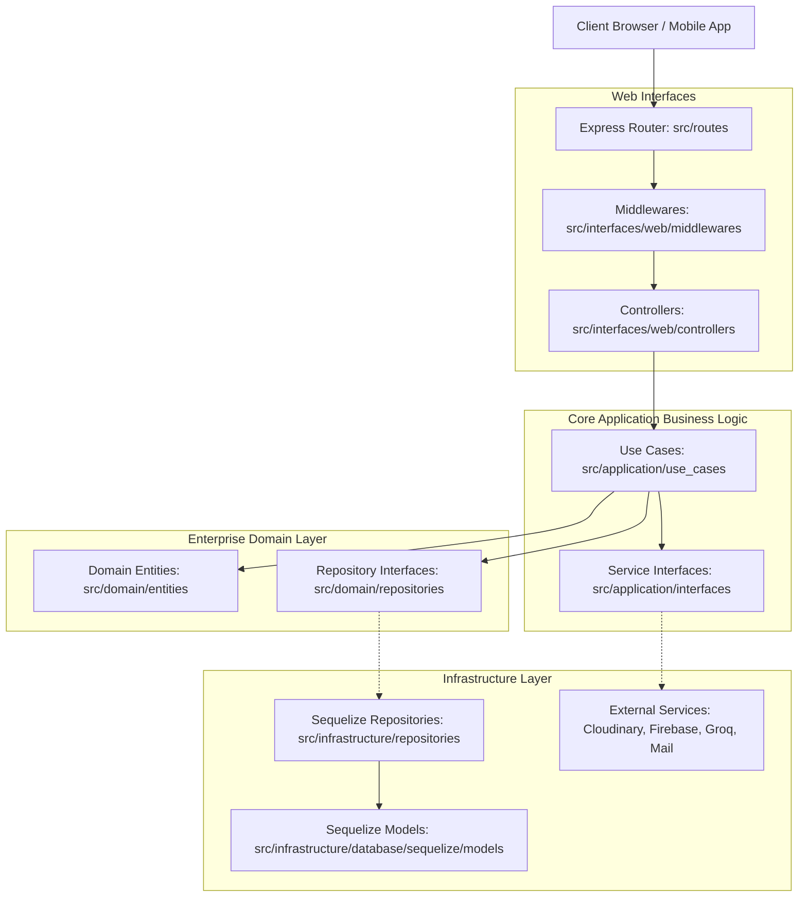

# Be Safe Food AI (Backend Hub)

[](https://nodejs.org/)
[](https://www.typescriptlang.org/)
[](https://expressjs.com/)
[](https://sequelize.org/)
[](#-architecture--design-patterns)
[](LICENSE)

Welcome to the central API server for **Be Safe Food AI** — an intelligent backend ecosystem powering real-time food safety scanning, personalized dietary advice, conversational AI, and critical food recall warnings.

This codebase is crafted using **100% TypeScript** and is architected under strict **Clean Architecture** patterns, leveraging dependency injection, strict domain isolation, and modular data models to ensure high scale, security, and developer clarity.

---

## 🌟 Key Capabilities

- 🔍 **AI Ingredient Analysis**: Seamless scanning of food labels to detect harmful additives, calculate safety ratings, and flag health hazards.
- 💬 **Conversational Health Assistant**: Custom AI-driven chat providing advice personalized to user profiles (allergies, health goals, and medical conditions).
- ⚠️ **Food Recalls & Push Alerts**: Auto-aggregates global/local food safety warnings, parses source URLs, tracks matching scan history, and broadcasts instant push alerts via Firebase Cloud Messaging (FCM).
- 🔐 **Secure Authentication**: Integration with Firebase Identity Provider, complete with secure OTP verification via Nodemailer and strict Express rate limiters.
- ☁️ **Cloud Storage**: Fast, reliable media and scan image hosting via Cloudinary.

---

## ⚙️ Tech Stack & Integrations

| Layer / Integration               | Technology Used                                                                               |
| :-------------------------------- | :-------------------------------------------------------------------------------------------- |
| **Runtime & Language**            | Node.js (v20+), TypeScript (Target: ES2022, CommonJS runtime compilation via `tsconfig.json`) |
| **Server Framework**              | Express.js (v5.x), CORS, Express Rate Limit                                                   |
| **Dependency Injection**          | `tsyringe` + `reflect-metadata`                                                               |
| **Database & ORM**                | MySQL, Sequelize ORM                                                                          |
| **Identity & Push Notifications** | Firebase Admin SDK, Firebase Cloud Messaging (FCM)                                            |
| **AI Assistants**                 | Groq SDK, Google Generative AI (Gemini SDK)                                                   |
| **Media Delivery**                | Cloudinary Wrapper Service                                                                    |
| **Integrations & Scrapers**       | Axios, JSDOM, Mozilla Readability, RSS Parser, Google News URL Decoder                        |

---

## 🏗 Architecture & Design Patterns

The project follows a **4-Layer Clean Architecture** enforcing strict dependency rules: _the inner layers do not know anything about the outer layers_.



### Flow of Execution

1.  **Request Input**: The client request passes through the main entry point `src/app.ts` to `src/routes/index.ts`.
2.  **Routing & Middleware**: Request is filtered by routing path (under `src/interfaces/web/routes`) and middleware (auth, rate limits).
3.  **Controller Delegation**: The controller parses parameters and invokes a specific, isolated business `UseCase`.
4.  **UseCase Orchestration**: The `UseCase` interacts with abstract domain repositories and service interfaces to perform business logic.
5.  **Data & Third-Party Execution**: Concrete implementations in `src/infrastructure` map inputs/outputs from databases or third-party APIs back to Domain entities.

---

## 📂 Project Structure

```
be_safe_food_ai/
├── dist/                          # Compiled JavaScript outputs (production bundle)
├── secrets/                       # Secure certificates & Firebase credentials keys
├── src/
│   ├── app.ts                     # Configures Express middleware, CORS, routing, and global errors
│   ├── server.ts                  # Server entry point; initializes DB connection, schema sync, and listens
│   ├── di/
│   │   └── container.ts           # Central Dependency Injection (tsyringe) registrations
│   ├── domain/                    # Enterprise Core Domain logic (Independent, zero external dependencies)
│   │   ├── entities/              # Business schemas and typescript types
│   │   ├── errors/                # Unified custom domain errors
│   │   └── repositories/          # Interface signatures for database operations
│   ├── application/               # Core application logic
│   │   ├── interfaces/            # Service adapters signatures (AI, Mail, Cloudinary, etc.)
│   │   └── use_cases/             # Executable business rules (one action class per file)
│   ├── infrastructure/            # Technical adapters and database configuration
│   │   ├── database/
│   │   │   └── sequelize/         # Sequelize connection parameters, models, and migration scripts
│   │   ├── repositories/          # Concrete repository implementations database queries
│   │   └── services/              # Integrations (Firebase SDK, Cloudinary, Groq AI, Nodemailer)
│   ├── interfaces/                # Web entry point
│   │   └── web/
│   │       ├── controllers/       # Express Controllers; maps requests parameters to Use Cases
│   │       ├── middlewares/       # Express Middleware handlers (auth check, requests validation)
│   │       └── routes/            # Path routes specific declarations
│   ├── routes/
│   │   └── index.ts               # Primary routing registry for mounting paths to `/api/v1`
│   ├── shared/                    # Constants, common statuses, and utility helpers
│   └── types/                     # Extra ambient declarations files (*.d.ts)
├── models.json                    # Configuration detailing compatible AI engine models
├── tsconfig.json                  # Compiler guidelines for TypeScript
├── package.json                   # Main scripts, engine descriptions, and dependencies
└── AI_GUIDELINES.md               # Onboarding and development guidelines for AI assistants
```

---

## 🛠 Setup & Installation

### Prerequisites

- [Node.js](https://nodejs.org/) (v20+ recommended)
- [MySQL Server](https://www.mysql.com/)

### 1. Clone & Dependencies Installation

```bash
git clone https://github.com/ThachDev/be_safe_food_ai.git
cd be_safe_food_ai
npm install
```

### 2. Environment Setup

Copy the environment template and customize key-value pairings:

```bash
cp .env.example .env
```

Key configuration properties to populate in `.env`:

- **Database Config**: Hostname, Port, DB Name, User Credentials.
- **Firebase Keys**: Admin project ID, client email, and private key strings.
- **API Credentials**: Groq API token, Cloudinary configurations, and SMTP email settings.

### 3. Running Database Migrations

Synchronize or run schema adjustments programmatically:

```bash
npm run migrate
```

---

## 🚀 Running the Application

### Development Mode (With Hot-Reloading)

Direct execution of TypeScript source files with file change listening:

```bash
npm run dev
```

### Production Compiling & Execution

Transpiles source modules to JS under `dist/` directory and boots the compiled build:

```bash
npm run build
npm start
```

---

## 🔗 Main API Endpoint Namespaces

All functional endpoints are mounted under `/api/v1`. Below is an overview of the root directories:

| Route namespace | Mounting Path     | Primary Purpose                                         |
| :-------------- | :---------------- | :------------------------------------------------------ |
| **Auth**        | `/api/v1/auth`    | Firebase login, OTP issuance, signup flows              |
| **Users**       | `/api/v1/users`   | Retrieve and update account-level metrics               |
| **Chat**        | `/api/v1/chat`    | AI dialog queries and chat history listing              |
| **News**        | `/api/v1/news`    | Global food recalls feed, cron alerts syncing           |
| **Scans**       | `/api/v1/scans`   | Image uploads, ingredient matching logic, safety rating |
| **Profile**     | `/api/v1/profile` | Update dietary types, allergies, health conditions      |
| **App**         | `/api/v1/app`     | Version status checks and metadata configurations       |
| **Health**      | `/api/v1/health`  | Service and connection status monitoring                |

---

## 📜 License

This project is licensed under the **ISC License**. For details, see the configurations inside `package.json`.
